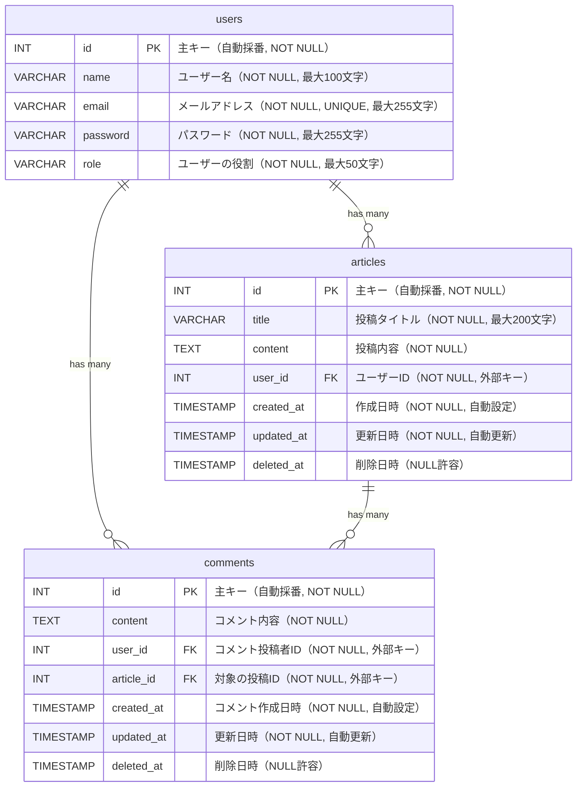

# BBSアプリケーションのテーブル設計とER図

```mermaid

erDiagram
    users {
        INT id PK "主キー（自動採番, NOT NULL）"
        VARCHAR name "ユーザー名（NOT NULL, 最大100文字）"
        VARCHAR email "メールアドレス（NOT NULL, UNIQUE, 最大255文字）"
        VARCHAR password "パスワード（NOT NULL, 最大255文字）"
        VARCHAR role "ユーザーの役割（NOT NULL, 最大50文字）"
    }

    articles {
        INT id PK "主キー（自動採番, NOT NULL）"
        VARCHAR title "投稿タイトル（NOT NULL, 最大200文字）"
        TEXT content "投稿内容（NOT NULL）"
        INT user_id FK "ユーザーID（NOT NULL, 外部キー）"
        TIMESTAMP created_at "作成日時（NOT NULL, 自動設定）"
        TIMESTAMP updated_at "更新日時（NOT NULL, 自動更新）"
        TIMESTAMP deleted_at "削除日時（NULL許容）"
    }
    
	comments {
        INT id PK "主キー（自動採番, NOT NULL）"
        TEXT content "コメント内容（NOT NULL）"
        INT user_id FK "コメント投稿者ID（NOT NULL, 外部キー）"
        INT article_id FK "対象の投稿ID（NOT NULL, 外部キー）"
        TIMESTAMP created_at "コメント作成日時（NOT NULL, 自動設定）"
        TIMESTAMP updated_at "更新日時（NOT NULL, 自動更新）"
        TIMESTAMP deleted_at "削除日時（NULL許容）"
    }
    users ||--o{ articles : "has many"
    users ||--o{ comments : "has many"
    articles ||--o{ comments : "has many"


```